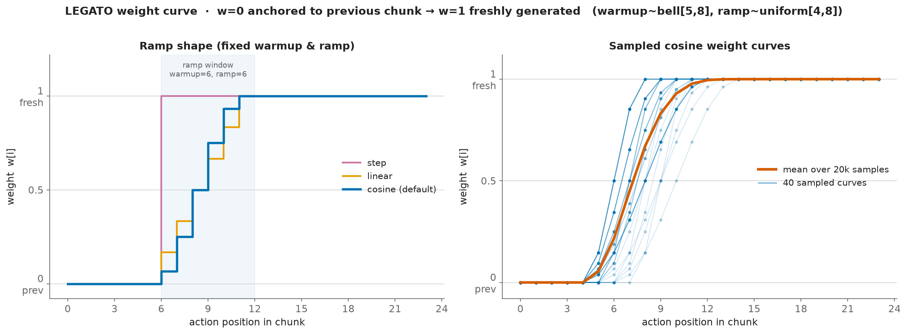

# lerobot_policy_pi05_legato

**LEGATO** as a variant of **π₀.₅ (pi05)** in the [LeRobot](https://github.com/huggingface/lerobot) codebase.

LEGATO ([*Learning Native Continuation for Action Chunking Flow Policies*](https://arxiv.org/abs/2602.12978)) layers a **guided flow** on top of the pi05 action expert so successive action chunks stay temporally consistent: the first `warmup` positions of a new chunk are anchored to the previously executed chunk (weight `w=0`) and smoothly handed over to freshly generated actions (`w=1`) — a *legato* transition.

> **Status.** Training path is implemented and self-contained (runs through stock `lerobot-train`, no dataset/processor changes). Inference runs, but the rolling previous-chunk buffer that feeds the continuation into `sample_actions` is still to be wired (`PI05LegatoPolicy`) — until then eval defaults to `w=1` (vanilla pi05).

## How to use

> **Prerequisite:** [LeRobot](https://github.com/huggingface/lerobot) must be installed.

```bash
pip install -e .
```

The policy is registered as **`pi05_legato`**:

```python
from lerobot_policy_pi05_legato.modeling_pi05_legato import PI05LegatoPolicy
```

Train (the `discover_packages_path` flag registers the plugin for the CLI):

```bash
lerobot-train \
  --policy.type=pi05_legato \
  --policy.discover_packages_path=lerobot_policy_pi05_legato \
  --policy.pretrained_path=lerobot/pi05_base \
  --policy.chunk_size=50 \
  --policy.warmup_min=5 --policy.warmup_max=8 \
  --policy.ramp_min=4  --policy.ramp_max=8 \
  --policy.weight_shape=cosine \
  ...
```

> `chunk_size` **must** exceed `warmup_max + ramp_max`, or the weight curve never reaches `1` (no freshly generated positions). Enforced in `PI05LegatoConfig.__post_init__`.

## Weight schedule

Each training example draws two integers and builds a per-position weight curve over the action chunk:

- `warmup ∈ [warmup_min, warmup_max]` — leading positions kept fully anchored (`w=0`).
- `ramp ∈ [ramp_min, ramp_max]` — length of the hand-over from anchored (`0`) to fresh (`1`).

```
w[i] = 0                            for i < warmup           (previous chunk)
     = shape((i - warmup + 1)/ramp) for warmup ≤ i < warmup+ramp   (hand-over)
     = 1                            for i ≥ warmup + ramp    (freshly generated)
```

`warmup` and `ramp` are each sampled per example (`bell` / `exp` / `uniform`). The hand-over `shape` is `step`, `linear`, or **`cosine`** (default, `0.5·(1−cos(πf))` — the smooth ramp the paper recommends for real-robot deployment; the reference Kinetix sim uses the hard `step`).



*Left:* the three ramp shapes at fixed `warmup`/`ramp`. *Right:* 40 cosine curves sampled from the default schedule (`warmup~bell[5,8]`, `ramp~uniform[4,8]`), with the mean over 20k samples. `w` is defined per (integer) action position, so a single curve is a discrete sequence — the markers are the actual values.

## Velocity target (guided flow)

Under pi05's flow-matching convention (`t: 1→0`, noise→data), with `x_t = t·noise + (1−t)·actions` and base velocity `noise − actions`, LEGATO's guided target is:

$$w = \text{weight curve},\qquad \kappa = \frac{1-w}{\Delta t},\qquad \Delta t = \frac{1}{\texttt{num\_inference\_steps}}$$

$$\text{guided } x_t = (1-w)\cdot\text{actions} + w\cdot x_t$$

$$u_t = (\text{noise} - \text{actions})\cdot\bigl(1 - \kappa\, t\bigr)$$

The loss is `MSE(u_t, vₜ)` over the real action dims. In **training** the anchor is the ground-truth `actions` itself (native continuation): on a single demonstration trajectory the aligned previous chunk equals the current chunk on the overlap, so no separate previous chunk is needed — only inference supplies the real (model-generated) previous chunk.

> **⚠️ Sign divergence from the reference.** The correction factor is `(1 − κ·t)` (pi05 time `t`), **not** the Legato-kinetix reference's `(1 + κ·(1−t_ref))`. Deriving the guided Euler update `x_{t+dt} = (1−w)·data + w·x_t + dt·v_t` gives `dx/dt = κ(data − x_t) + v_t`; requiring `x` to ride the straight flow path onto `data` forces the **minus** sign. Simulating the discrete scheme confirms `(1 − κ·t)` lands on `data` exactly for every `w`, while `(1 + …)` overshoots by 20–60 % for `0 < w < 1`. The reference's sign error is masked in its hard-step sim (only `w ∈ {0,1}` occur, and only the `w=1`/`κ=0` positions are executed) but *does* bite for the cosine ramp used here.

The per-position weight is conditioned into the expert by writing `w` into an unused **action padding slot** (`original_action_dim`, which pi05 pads to `max_action_dim` and ignores in the loss) — so no change to `action_in_proj` and pretrained pi05 checkpoints load unchanged.

## Layout

```
src/lerobot_policy_pi05_legato/
├── __init__.py
├── configuration_pi05_legato.py   # PI05LegatoConfig(PI05Config) + schedule validation
├── modeling_pi05_legato.py        # PI05PytorchLEGATO(PI05Pytorch), PI05LegatoPolicy(PI05Policy)
├── processor_pi05_legato.py       # make_pi05_legato_pre_post_processors(...)
└── utils.py                       # weight-curve sampling / construction (PyTorch)
```
